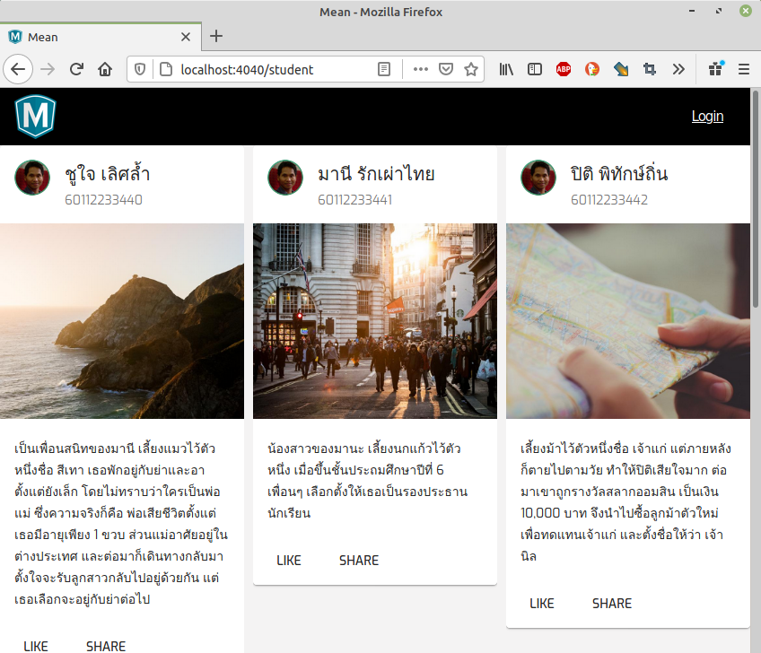

# การสร้างหน้า student เพื่อแสดงข้อมูล

## 1. แก้ไขนิยามของ student ใหม่ในไฟล์ `server/models/student.model.js` 

```js
const mongoose = require('mongoose');

/**
 * อ่านเพิ่มเติม https://mongoosejs.com/docs/guide.html
 */
const StudentSchema = new mongoose.Schema(
  {
    sid:       { type: String, required: true },
    first:     { type: String, required: true },
    last:      { type: String, required: true },
    info:      { type: String, required: true },
    createdAt: { type: Date, default: Date.now },
  },
  {
    versionKey: false
  }
);


module.exports = mongoose.model('Student', StudentSchema);
```

## 2. ลบข้อมูลใน meanmongo แก้ไขไฟล์ `scripts/init-students.js`

```js
const mongoose = require('mongoose');
const util = require('util');
const debug = require('debug')('express-mongoose-es6-rest-api:index');

const config = require('../server/config/config');

const Student = require('../server/models/student.model');

// connect to mongo db
const mongoUri = config.mongo.host;
mongoose.connect(mongoUri, { keepAlive: 1 });
mongoose.connection.on('error', () => {
  throw new Error(`unable to connect to database: ${mongoUri}`);
});


const students = [
  { sid: 60112233440, first: 'ชูใจ', last: 'เลิศล้ำ', info: 'เป็นเพื่อนสนิทของมานี เลี้ยงแมวไว้ตัวหนึ่งชื่อ สีเทา เธอพักอยู่กับย่าและอาตั้งแต่ยังเล็ก โดยไม่ทราบว่าใครเป็นพ่อแม่ ซึ่งความจริงก็คือ พ่อเสียชีวิตตั้งแต่เธอมีอายุเพียง 1 ขวบ ส่วนแม่อาศัยอยู่ในต่างประเทศ และต่อมาก็เดินทางกลับมา ตั้งใจจะรับลูกสาวกลับไปอยู่ด้วยกัน แต่เธอเลือกจะอยู่กับย่าต่อไป' },
  { sid: 60112233441, first: 'มานี', last: 'รักเผ่าไทย', info: 'น้องสาวของมานะ เลี้ยงนกแก้วไว้ตัวหนึ่ง เมื่อขึ้นชั้นประถมศึกษาปีที่ 6 เพื่อนๆ เลือกตั้งให้เธอเป็นรองประธานนักเรียน' },
  { sid: 60112233442, first: 'ปิติ', last: 'พิทักษ์ถิ่น', info: 'เลี้ยงม้าไว้ตัวหนึ่งชื่อ เจ้าแก่ แต่ภายหลังก็ตายไปตามวัย ทำให้ปิติเสียใจมาก ต่อมาเขาถูกรางวัลสลากออมสิน เป็นเงิน 10,000 บาท จึงนำไปซื้อลูกม้าตัวใหม่ เพื่อทดแทนเจ้าแก่ และตั้งชื่อให้ว่า เจ้านิล' },
  { sid: 60112233443, first: 'มานะ', last: 'รักเผ่าไทย', info: 'พี่ชายของมานี เลี้ยงสุนัขไว้ตัวหนึ่งชื่อ เจ้าโต เขาขยันตั้งใจเรียน จึงมีผลการเรียนดี จึงเป็นนักเรียนคนเดียวของโรงเรียน ที่สามารถเข้าศึกษาต่อระดับมัธยมศึกษาในกรุงเทพมหานคร เมื่อจบการศึกษาชั้นประถมปีที่ 6' },
  { sid: 60112233444, first: 'วีระ', last: 'ประสงค์สุข', info: 'มีพ่อเป็นทหาร แต่เสียชีวิตในระหว่างรบ ตั้งแต่วีระยังอยู่ในท้อง ส่วนแม่ตรอมใจ เสียชีวิตหลังจากคลอดวีระได้ 15 วัน ทำให้เขาต้องอยู่กับลุงตั้งแต่เกิด และเลี้ยงลิงแสมไว้ตัวหนึ่งชื่อ เจ้าจ๋อ' }
];

Student.insertMany(students, (error, docs) => {
  if (error) {
    console.error(error);
  } else {
    console.log(docs);
  }
  mongoose.connection.close();
});
```

## 3. นำเข้าข้อมูลทดสอบใหม่ 

```sh
node scripts/init-students.js
```

## 4. สร้าง `student.service.ts` 

```sh
ng g service shared/services/student
```

## 5. แก้ไขคำสั่งในไฟล์ `src/app/shared/services/student.service.ts`

```ts
import { Injectable } from '@angular/core';
import { HttpClient } from '@angular/common/http';

//import { Observable, throwError } from 'rxjs';
//import { catchError, retry } from 'rxjs/operators';

@Injectable({
  providedIn: 'root'
})
export class StudentService {

  constructor(private http: HttpClient) { }

  getAll() {
    return this.http.get('api/student/all');
  }

}
```

## 6. สร้าง `student` component

```sh
ng g c student
```

## 7. เพิ่มเส้นทางเข้าถึงในไฟล์ `src/app/app-routing.module.ts`

```ts
import { NgModule } from '@angular/core';
import { RouterModule, Routes } from '@angular/router';

import { AuthGuard } from './shared/guards';
import { HomeComponent } from './home/home.component';
import { HeroComponent } from './hero/hero.component';
import { StudentComponent } from './student/student.component';

const routes: Routes = [
  {
    path: '',
    component: HomeComponent,
    canActivate: [AuthGuard],
  },
  {
    path: 'hero',
    component: HeroComponent,
  },
  {
    path: 'student',
    component: StudentComponent,
  },
  {
    path: 'auth',
    loadChildren: () => import('./auth/auth.module').then(m => m.AuthModule),
  },
  {
    path: 'admin',
    loadChildren: () => import('./admin/admin.module').then(m => m.AdminModule),
  },
];

@NgModule({
  imports: [RouterModule.forRoot(routes)],
  exports: [RouterModule],
})
export class AppRoutingModule {}
```

## 8. แก้ไขคำสั่งในไฟล์ `src/app/student/student.component.ts`

```ts
import { Component, OnInit } from '@angular/core';
import { StudentService } from '../shared/services/student.service';

@Component({
  selector: 'app-student',
  templateUrl: './student.component.html',
  styleUrls: ['./student.component.css']
})
export class StudentComponent implements OnInit {

  students: any[] = [];

  constructor(private studentService: StudentService) { }

  ngOnInit(): void {
    this.studentService.getAll().subscribe( (resp: any) => {
      this.students = resp;
    });
  }

}
```

## 9. เพิ่ม MatGridListModule ในไฟล์ `src/app/shared/shared.module.ts`

```ts
//... คำสั่งเดิม
import { MatGridListModule } from '@angular/material/grid-list';

@NgModule({
  exports: [
    //...คำสั่งเดิม
    MatGridListModule,
  ],
})
export class SharedModule {}
```

## 10. แก้ไขคำสั่งในไฟล์ `src/app/student/student.component.css`

```css
.student-header-image {
  background-image: url('https://wichit2s.gitlab.io/assets/images/paul_profile_96x96.png');
  background-size: cover;
}
:host >>> .mat-figure{
  align-items: start !important;
}
```

## 11. แก้ไขคำสั่งในไฟล์ `src/app/student/student.component.html`

```html
<!--
  <div>{{ students | json }}</div>
-->
<mat-grid-list cols="3" rowHeight="720px" gutterSize="10px">
  <mat-grid-tile *ngFor="let s of students">
    <mat-card>
      <mat-card-header>
        <div mat-card-avatar class="student-header-image"></div>
        <mat-card-title>{{ s.first }} {{ s.last }}</mat-card-title>
        <mat-card-subtitle>{{ s.sid }}</mat-card-subtitle>
      </mat-card-header>
      
      <mat-card-content>
        <p> {{ s.info }} </p>
      </mat-card-content>
      <mat-card-actions>
        <button mat-button>LIKE</button>
        <button mat-button>SHARE</button>
      </mat-card-actions>
    </mat-card>
  </mat-grid-tile>
</mat-grid-list>

```

## 12. เรียกดูข้อมูลได้จาก `http://localhost:4000/student`


